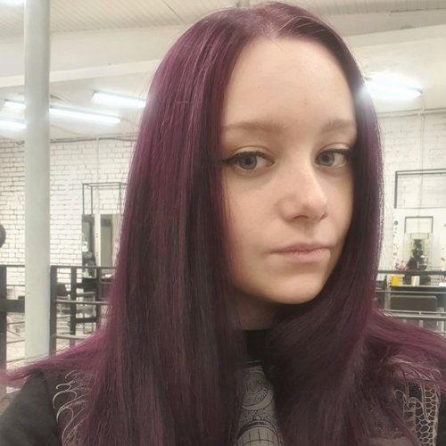

# Портфолио

## Добрый день, будущие коллеги!

Давайте знакомиться. Меня зовут Филина Екатерина Евгеньевна. Я начинающий *тестировщик ПО*. Работаю Инженером опытной эксплуатации в одной из ведущих компаний по телокоммуникациям в стране. Закончила институт по специальности: **"Телекоммуникации и связь на железнодорожном транспорте"**. В данный момент прохожу обучение на тестировщика, так же занимаюсь самообучением и применяю полученные навыки в работе.
### Чем горжусь:
1. Опыт работы в инженерных проффесиях более четырёх лет;
2. Быстрая обучаемость;
3. Стремление к идеалу;
4. Знакома и работаю в таких сервисах как Confluence, Jira, Redmain, Git, Testrail;
5. Знаю как общаться и работать с Postman, VS.
6. Изучаю и интересны такие языки программирования как: Java, JS, JSON, Python.

Более подробную информации обо мне можно посмотреть на [hh.ru](https://hh.ru/resume/9dae70ddff072ceb180039ed1f356364735839).  
Спасибо за внимание!  
